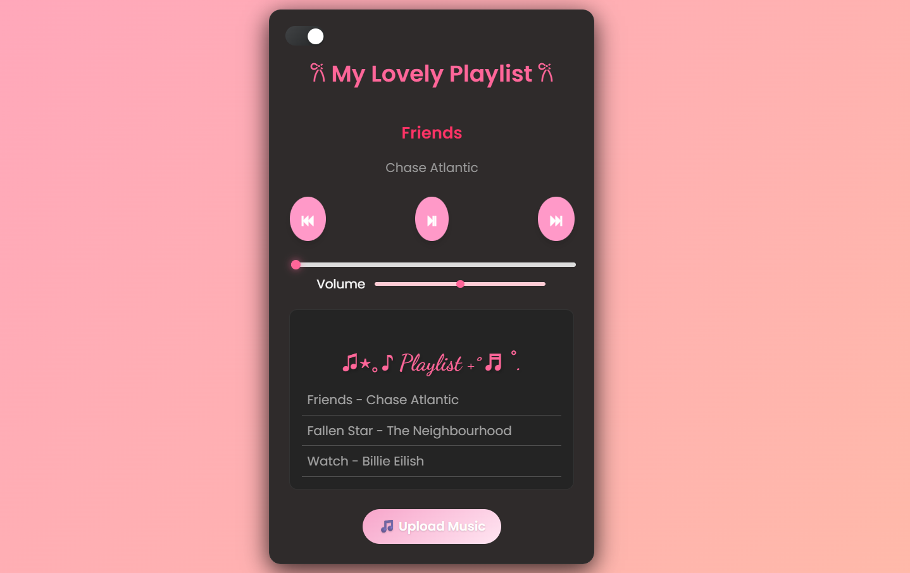

# 🎵 Advanced Music Player

A beautiful, responsive web-based music player with a modern UI, dark/light theme toggle, and playlist functionality.



## ✨ Features

- 🎼 **Playlist Management**: Pre-loaded with songs and ability to add your own
- 🎨 **Visual Appeal**: Gradient background with animation
- 🌙 **Dark/Light Mode**: Toggle between themes
- 📱 **Responsive Design**: Works on desktop and mobile devices
- ⏯ **Playback Controls**: Play, pause, next, previous
- 🔊 **Volume Control**: Adjustable volume slider
- 📊 **Progress Bar**: Visual progress indicator with seek functionality
- 🎵 **Custom Uploads**: Upload your own music files
- 🎭 **Playlist Interaction**: Click any song to play instantly
- ✨ **Visual Feedback**: Hover effects and active song highlighting

## 🚀 Getting Started

### Prerequisites

- A modern web browser (Chrome, Firefox, Safari, Edge)
- Basic knowledge of HTML, CSS, and JavaScript (for customization)

### Installation

1. Clone the repository:
```bash
git clone https://github.com/ZahiraK/music-player.git
```

2. Navigate to the project directory:
```bash
cd music-player
```

3. Open `index.html` in your web browser:
```bash
# On Windows
start index.html

# On macOS
open index.html

# On Linux
xdg-open index.html
```

Alternatively, you can serve the files using a local server:

```bash
# Using Python 3
python -m http.server 8000

# Using Node.js (if you have http-server installed)
npx http-server
```

Then visit `http://localhost:8000` in your browser.

## 📁 Project Structure

```
music-player/
│
├── assets/
│   └── screenshot.png      # Project screenshot
├── songs/                  # Directory containing audio files
│   ├── Friends - Chase Atlantic.mp3
│   ├── Fallen Star.mp3
│   └── watch.mp3
├── index.html              # Main HTML file
├── style.css               # Styles and animations
├── script.js               # JavaScript functionality
└── README.md               # Project documentation
```

## 🎮 How to Use

### Basic Controls
- **⏯ Play/Pause**: Toggle playback
- **⏭ Next**: Skip to next song
- **⏮ Previous**: Go to previous song
- **Progress Bar**: Click to seek through the current song
- **Volume Slider**: Adjust playback volume

### Playlist Features
- Click any song in the playlist to play it immediately
- Active song is highlighted with a glowing effect
- Hover over songs for visual feedback

### Custom Music
- Click "🎵 Upload Music" to add your own audio files
- Supported formats: MP3, WAV, OGG, and other browser-supported audio formats
- Uploaded songs are added to the playlist and persist during the session

### Theme Toggle
- Use the toggle switch in the top-left corner to switch between light and dark themes

## 🛠️ Customization

### Adding Default Songs
Edit the `mySongs` array in `script.js`:

```javascript
const mySongs = [
    {
        title: "Your Song Title",
        artist: "Artist Name",
        filePath: "./songs/your-song-file.mp3"
    },
    // Add more songs here...
];
```

### Styling Changes
Modify `style.css` to customize:
- Colors and gradients
- Fonts and typography
- Layout and spacing
- Animations and transitions

### Adding Features
Extend `script.js` to add:
- Shuffle functionality
- Repeat modes
- Equalizer settings
- Keyboard shortcuts

## 🌐 Browser Compatibility

- Chrome 60+
- Firefox 55+
- Safari 12+
- Edge 79+

## 📝 License

This project is open source and available under the [MIT License](LICENSE).

## 🤝 Contributing

Contributions, issues, and feature requests are welcome! Feel free to check [issues page](https://github.com/ZahiraK/music-player/issues).

## 📧 Contact

ZahiraK - [GitHub Profile](https://github.com/ZahiraK)

Project Link: [https://github.com/ZahiraK/music-player](https://github.com/ZahiraK/music-player)

## 🙏 Acknowledgments

- Fonts provided by [Google Fonts](https://fonts.google.com/)
- Inspired by modern music player designs
- Thanks to all contributors and testers
